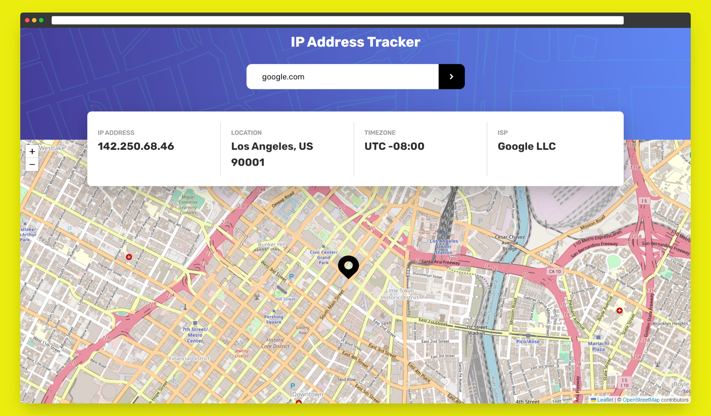

## Table of contents

- [🧭 IP Address Tracker](#-ip-address-tracker)
  - [📌 Overview](#-overview)
    - [🎯 Challenge](#-challenge)
    - [📸 Screenshot](#-screenshot)
    - [🔗 Links](#-links)
  - [🚂 My process](#-my-process)
    - [🧰 Built With](#-built-with)
    - [📝 What I learned](#-what-i-learned)
    - [🔭 Future features](#-future-features)
    - [💎 Useful resources](#-useful-resources)
  - [📧 Connect wit me](#-connect-wit-me)
  - [🤝 Contributing](#-contributing)
  - [💖 Show your support](#-show-your-support)
  - [📜 License ](#-license-)

# 🧭 IP Address Tracker

**IP Tracker** is a website that allows users to track the location of an IP address or domain name. This is a solution to the [IP address tracker challenge on Frontend Mentor](https://www.frontendmentor.io/challenges/ip-address-tracker-I8-0yYAH0).

## 📌 Overview

### 🎯 Challenge

Users should be able to:

- View the optimal layout for each page depending on their device's screen size
- See hover states for all interactive elements on the page
- See their own IP address on the map on the initial page load
- Search for any IP addresses or domains and see the key information and location

### 📸 Screenshot

### 🔗 Links

- Solution URL: [GitHub Repo](https://github.com/IndieCoderMM/ip-tracker)
- Live Site URL: [IP Tracker Website](https://indiecodermm.github.io/ip-tracker)

## 🚂 My process

### 🧰 Built With

- [React.js](https://reactjs.org/) - to create UI and dynamic components
- [React Leaflet](https://react-leaflet.js.org/) - to visualize geolocation data
- [Redux Toolkit](https://redux-toolkit.js.org/) - to manage the state and API calls
- [IP Geolocation API](https://geo.ipify.org/) - to locate IP address
- [ipify API](https://www.ipify.org/) - to get client IP address

### 📝 What I learned

This project allowed me to deepen my understanding of React and Redux and develop many other skills and knowledge in web development.
- I learned how IP address and domain work and how they can be used to locate a website.
- I learned how to use React Leaflet to provide an interactive and intuitive way to view maps.
- I learned how to handle errors effectively in redux thunks and how to improve UX when errors occur.

### 🔭 Future features

- [ ] User Authentication to provide personalized experience
- [ ] Show Remaining Credits for the API
- [ ] Feedback System to get suggestion and bug report

### 💎 Useful resources

- [Create Maps using React Leaflet](https://youtu.be/2KUYOdTXK74) - Tutorial on how to use Leaflet in React
- [Handling errors with Redux Toolkit](https://stackoverflow.com/questions/63439021/handling-errors-with-redux-toolkit) - StackOverflow thread on error handling with Redux toolkit

## 📧 Connect wit me

I am always looking for ways to improve my project. If you have any suggestions or ideas, I would love to hear from you.
- GitHub - [IndieCoderMM](https://www.your-site.com)
- Frontend Mentor - [@yourusername](https://www.frontendmentor.io/profile/yourusername)
- Linkedin - [@hthantoo](https://www.linkedin.com/in/hthantoo/)
- Gmail - [hthant00chk@gmail.com](mailto:hthant00chk@gmail.com)

## 🤝 Contributing

I welcome any and all contributions to my website! If you have an idea for a new feature or have found a bug, please open an issue or submit a pull request.

Feel free to check the [issues page](../../issues/).

## 💖 Show your support
If you like this project, please consider giving it a ⭐.

## 📜 License 

This project is [MIT](./LICENSE) licensed.
